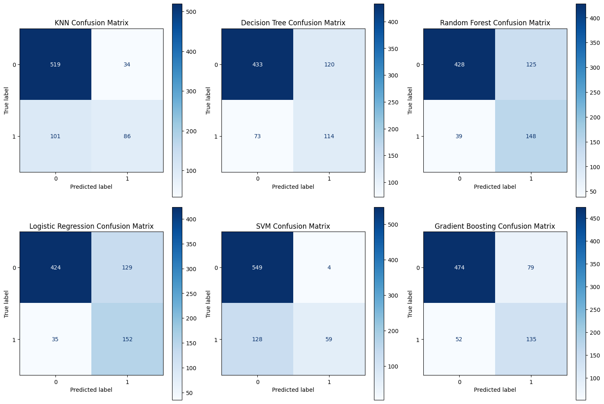

# Sydney Rain Prediction
## Introduction
Welcome to the Sydney Rain Prediction Project! This project aims to leverage historical weather data to develop models that can predict whether it will rain in Sydney tomorrow. Accurate rain predictions are crucial for a wide range of applications, including agriculture, disaster management, transportation, and daily planning.
## Dataset 
The original source of the data is Australian Government's Bureau of Meteorology http://www.bom.gov.au/climate/dwo/.

There are 2 datasets used in this project. They contain observations of weather metrics for each day. They have columns with the same definitions.

| Field          | Description                                                | Unit             | Type               |
|----------------|------------------------------------------------------------|------------------|--------------------|
| Date           | Date of the Observation in YYYY-MM-DD                      | Date             | Date object        |
| Location       | Location of the Observation                                |                  | Location object    |
| MinTemp        | Minimum temperature                                        | Celsius          | float              |
| MaxTemp        | Maximum temperature                                        | Celsius          | float              |
| Rainfall       | Amount of rainfall                                         | Millimeters      | float              |
| Evaporation    | Amount of evaporation                                      | Millimeters      | float              |
| Sunshine       | Amount of bright sunshine                                  | hours            | float              |
| WindGustDir    | Direction of the strongest gust                            | Compass Points   | object             |
| WindGustSpeed  | Speed of the strongest gust                                | Kilometers/Hour  | object             |
| WindDir9am     | Wind direction averaged over 10 minutes prior to 9am       | Compass Points   | object             |
| WindDir3pm     | Wind direction averaged over 10 minutes prior to 3pm       | Compass Points   | object             |
| WindSpeed9am   | Wind speed averaged over 10 minutes prior to 9am           | Kilometers/Hour  | float              |
| WindSpeed3pm   | Wind speed averaged over 10 minutes prior to 3pm           | Kilometers/Hour  | float              |
| Humidity9am    | Humidity at 9am                                            | Percent          | float              |
| Humidity3pm    | Humidity at 3pm                                            | Percent          | float              |
| Pressure9am    | Atmospheric pressure reduced to mean sea level at 9am      | Hectopascal      | float              |
| Pressure3pm    | Atmospheric pressure reduced to mean sea level at 3pm      | Hectopascal      | float              |
| Cloud9am       | Fraction of the sky obscured by cloud at 9am               | Eights           | float              |
| Cloud3pm       | Fraction of the sky obscured by cloud at 3pm               | Eights           | float              |
| Temp9am        | Temperature at 9am                                         | Celsius          | float              |
| Temp3pm        | Temperature at 3pm                                         | Celsius          | float              |
| RainToday      | If there was rain today                                    | Yes/No           | object             |
| RainTomorrow   | If there is rain tomorrow                                  | Yes/No           | float              |

#### Dataset 1
This dataset contains observations of weather metrics for each day from 2008 to 2017, named **weatherAUS.csv**.

Actually, the website mentioned above do not provide the dataset anymore, so I use the dataset (which is a copy of the original dataset) from https://www.kaggle.com/datasets/jsphyg/weather-dataset-rattle-package

There are (3344, 22) data.

#### Dataset 2
This dataset contains observations of weather metrics for each day from May 2023 to May 2024, in http://www.bom.gov.au/climate/dwo/IDCJDW2124.latest.shtml.

The website do not provide a large dataset in a csv file, but 13 different csv files for 13 months.

There are (397, 22) data.

## Data processing 

#### Combine two datasets
Although two datasets have columns with the same definitions, there are some differences in name. So the first thing to do is to rename the columns. Then just combine them as usual. 

#### Categorical values
+ *WindSpeed3pm* column has value *Calm* which represents that there is no wind on that date, so fill these *Calm* with *0.0* value.

+ Using **Cramér's V**, it can be concluded that *WindGustDir*, *WindDir9am*, *WindDir3pm* has enough correlation to the prediction. So these values will be handled with Dummy Encoding.

+ The *RainToday* column is currently *Yes/No* value, also handle this with Dummy Encoding.

#### NA values 
+ The main task to do is to predict the tomorrow rain status, so for columns such as *RainToday*, *RainTomorrow*, *Rainfall*, if there is any NA value, drop the data.

+ In *MaxTemp* and *MinTemp* column, the NA values will be filled with the maximum and minimum value of the same month, respectively. 

+ In other numerical columns, the NA values will be filled with the averaged values of the same month. 

#### Outliers
Using **Zscore**, the outliers are dropped.

## Training
All of these algorithms are implemented with **scikit-learn**.
#### KNN
+ Using **n_neighbors=4**, which is randomly choosen.
+ Using **ROC curve** to determine the optimal threshold for prediction.

#### Decision Tree 

#### Random Forest
+ Using **n_estimators=200, random_state=24**, which are randomly choosen.
+ Using **ROC curve** to determine the optimal threshold for prediction.

#### Logistic Regression
+ Using **solver='liblinear'**, which is reasonable for small dataset.
+ Using **ROC curve** to determine the optimal threshold for prediction.

#### SVM
+ Using **kernel='rbf', C=10**, which are randomly choosen.

#### Gradient Boosting
+ Using **n_estimators=500, max_depth=4, min_samples_split=5, learning_rate=0.01, loss="log_loss"**, which are randomly choosen.
+ Using **ROC curve** to determine the optimal threshold for prediction.

## Evaluation

#### Metrics
| **Model**          | **Accuracy**                                               | **Jaccard Index**             | **F1 Score**               |
|----------------|------------------------------------------------------------|------------------|--------------------|
| KNN           | 0.817568	|0.691375	|0.802871
| Decision Tree	|0.739189|	0.610738	|0.747960
| Random Forest	|0.778378	|0.660148	|0.789752
| Logistic Regression	|0.778378|	0.660421|	0.790343
| SVM	|0.821622|	0.680507|	0.786375
| Gradient Boosting	|0.822973	|0.713737|	0.826718

In this evaluation, as the values are all highest, **Gradient Boosting** can be concluded to be the best algorithm.

#### Confusion matrix

In this evaluation, it can be concluded that **Logistic Regression** is the best since this algorithm give the most *positive* cases.
